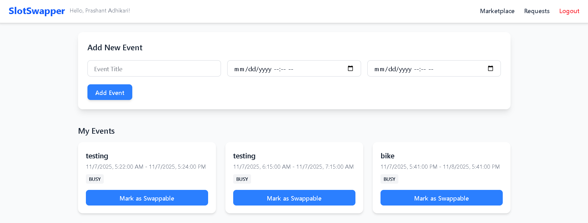

---

### **2️⃣ Frontend README.md**

```markdown
# SlotSwapper Frontend

**SlotSwapper Frontend** is a React.js application for managing and swapping time slots. Tailwind CSS is used for styling, and Axios handles API calls to the backend.

---

## Table of Contents
- [Overview](#overview)
- [Tech Stack](#tech-stack)
- [Setup & Installation](#setup--installation)
- [Features](#features)
- [License](#license)

---

## Overview
SlotSwapper Frontend allows users to:
- Signup/Login
- Add events and mark them as swappable
- View swappable slots from other users
- Request and respond to swap requests
- Manage events through a clean dashboard

---

## Tech Stack
- React.js
- Tailwind CSS
- React Router
- Axios for API calls

---

## Setup & Installation

### Prerequisites
- Node.js (v18+)
- npm or yarn
- Backend server running

### Steps
```bash
# Clone frontend repository
git clone <frontend-repo-url>
cd frontend

# Install dependencies
npm install

# Create a .env file with the backend URL
VITE_API_URL=http://localhost:5000

# Start development server
npm run dev

# Demo




